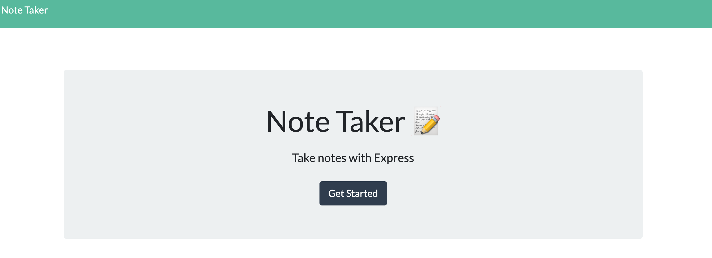
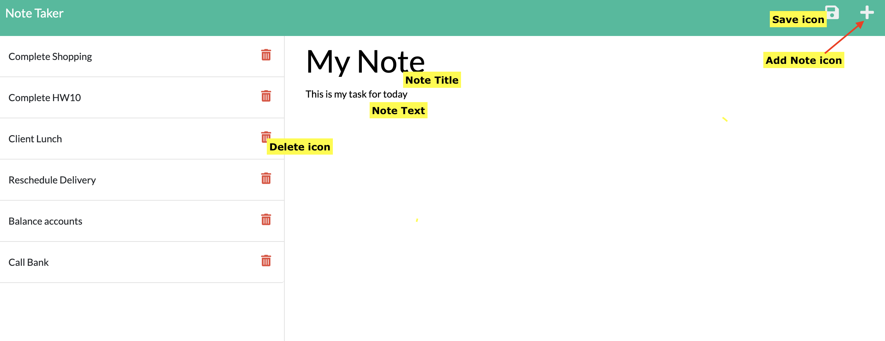

# Note Taker 

_Note Taker_ is a web-based tool that allows users to write and save text-based notes.

- The application is created using the `Express - Node.js` web application framework. Notes are saved and retrieved to and from a `JSON` file.
- Deployed application URL (on `heroku`) : https://peaceful-escarpment-73157.herokuapp.com/

## Table of Contents

- [Installation](installation)
- [Usage instructions](usage-instructions)
- [Preview of the application](preview-of-the-application)
- [Testing (Routes)](testing-routes)

## Installation

No installation is needed. However, if you wish to fork the repo:

1. Download/fork the repo from GitHub to your local folder.
2. Run the command `npm install` to install the following npm packages:

- Express
- uuid
- alert (_not used_)

## Usage instructions

```md
#### Accessing the application

- Go to the URL from your web browser: https://peaceful-escarpment-73157.herokuapp.com/
- Alternatively, if you have downloaded the repository to your local machine
run the command `node server.js` from the terminal.
```

```md
#### Create a Note

1. From thew homepage select `Get Started`.
2. Select `+` icon.
3. Enter a _Note Title_ and _Note Text_
4. Select the Save icon. The Save icon appears as you enter the note.
```

```md
#### Delete a Note

**Note**: This operation will delete your note permanently

1. From thew homepage select `Get Started`.
2. Select the required Delete icon.
```

## Preview of the application

### Homepage



### Note Taker



## Testing (Routes)

The following HTML routes are created:

- `GET /notes` returns the `notes.html` file
- `GET *` returns the `index.html` file.

The following API routes are created:

- `GET /api/notes` reads the `db.json` file
- `POST /api/notes` creates a new note (user clicks on the `save` icon)
- `DELETE /api/notes/:id` deletes an existing note (user clicks on the `delete` icon).
